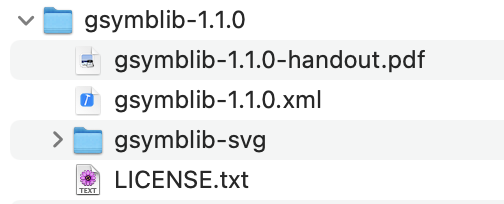

# gsymblib: Geologic mapping symbol library and development for QGIS
#### Alessandro Frigeri, IAPS/INAF - Dec, 2021

This project brings into QGIS symbols useful in geological mapping.  Styling for points, lines, fill patterns and gradients are included.  The symbols currently included in the library can be found in the [STATUS table](STATUS.md).  Currently the library includes symbols defined by the
Federal Geographic Data Committee (FGDC), but the project is structured in a way that others libraries from different mapping authorities/institutions can be easily added.

The features of __gsymblib__ are:
 * bring into QGIS a set of geologic symbols which are:
    - __ordered__: family (for example agency standards) of symbols are separated
    - __documented__: every symbol/line/pattern has always three elements: graphics/ID/description.
    - __incrementally improvable/upgradable__: new single symbols can be added to the library, or some symbols can be individually fixed  

## News

* Dec 10, 2021: added experiental support to Resource Manager Plugin (online install process)
* Sep  1, 2021: added rotational symbols
* Jan 25, 2021: develop tree created
* Feb 22, 2020: added symbolsplitter script
* Oct 16, 2019: [gsymblib 1.0.0-rc1 is out](https://github.com/afrigeri/geologic-symbols-qgis/releases).  The first release of the gsymblib includes all the FGDC symbol-set for planetary geology.

## System requirements

A functional QGIS 3.22.x (released on Nov, 2021) or more recent software installation on MS Windows, OS X or GNU/Linux.  For building the library on your own or developing the build framework, we spot QGIS 3.10 LTR as the target version.

## Installation and setup

Here you are the instructions to install the gsymblib (all symbols and patterns) in your local QGIS installation.

1. Download the [latest gsymblib](./dist/gsymblib-1.1.0.zip) or the [official release](https://github.com/afrigeri/geologic-symbols-qgis/releases) zip files.
2. Extract the zip archive and move the __gsymblib-svg__ directory to a place where you want to store the patterns and symbols.  It can be any directory.
3. Now open QGis and go to 'Settings -> Options' (Ubuntu) or 'Preferences' (OSX) and select the second tab from the top: 'System'
4. Under the __SVG Paths__ formi, click the add button and select the the __gsymblib-svg__ directory from your file system.
5. Exit from QGIS and re-open it to make __SVG Paths__ modifications active.
5. In QGis, go to __Settings__ -> __Style Manager__ and click on __Import/Export__ -> __Import items__ button (at bottom-left)
6. Select the __geologic_symblib-X.Y.Z.xml__ file extracted from the zip file, then __select all__ button at the bottom, and then __import__ button.
7. Now you should now have the geologic symbols listed and ready to style your geologic maps in your QGis!

## How to contribute: add new symbols or fix existing ones

If you don't find a symbol in the [STATUS](STATUS.md) table, or you have found a mistake, you can contribute to the project.

There are several options to contribute to this project, as adding new symbols or refer a problem in an existing symbols.

1. Clone and work on your local copy
or
2. If you want to add symbols/graphics or update/fix existing ones, send the single symbol/svg __one symbol/graphics per file__ in the 'issue' section above on this page. When submitting the symbol select the 'New Symbol' green tag or the 'Symbol Fix' orange tag from the menu on the right, and attach the xml/svg file to the issue message (you will have to rename it .txt).

Remember to follow these simple guidelines:
1. Symbols should comply as much as possible with the original instructions.  If something can not be replicated, just indicate it in the issue tracker for future reference.
2. __Naming__: all the symbols should be named as follow: [code or id] : [Description]. This way it will be much more easier to use the symbols in QGIS as they will be ordered and can be dynamically searched from the graphical interface.
3. For __asymmetric symbols__ ad scarps or thrusts, convention here is to draw features clockwise, or leave the symbol to the left of the line.  For example, the downthrown block of a normal fault is stays on the left of the line.

## Usage notes and conventions

Convention here is to draw area features clockwise, and linear features with patterns drawn on the left side, so non-symmetric symbology is displayed correctly.

##  Developer info

If you want to contrbute to the development of the build system, you need to setup your environment. If you have OSX, the reference development environment is QGIS 3.10-LTR, which is know to to run standalone python/QGIS scripts without problems.  With GNU/Linux you can use the most up-to-date package, but you have to make sure to have python3-qgis package installed.  We also need [svg2svgt](https://github.com/manisandro/svg2svgt) to convert SVG into TinySVG.

## Similar projects

The problem of having a meaningful symbology in modern softwares has been in the air from a while.  Similarly to this project some other example have been available and are actively creating interesting solutions.

 * [QGis Geologic Symbols project from Ryan Mikulovsky at ucdavis, 2010](http://geo.distortions.net/2010/12/geologic-symbology-for-qgis.html)
 * [Stefan Revets project on SourceForge, 2015-2016](https://sourceforge.net/projects/qgisgeologysymbology/)
 * [FGCD Geologic Patterns for the Web by Daven Quinn, 2017](https://davenquinn.com/projects/geologic-patterns/). This project adopts the FGDC pattern of Daven Quinn, contributed by USGS personnell.
 * [FGDC-4-QGIS by GeoProc.com](https://github.com/BC-Consulting/FGDC-4-QGIS) FGDC fill geology symbols library for QGIS 3.x.

## References

* gsymblib v1.0 - Geologic symbols library and development environment for QGIS [doi:10.20371/INAF/SW/2019_00007](http://dx.doi.org/10.20371/INAF/SW/2019_00007)

* A. Nass, S. van Gasselt, R. Jaumann, H. Asche, Implementation of cartographic symbols for planetary mapping in geographic information systems, Planetary and Space Science, Volume 59, Issues 11-12, September 2011, Pages 1255-1264, ISSN 0032-0633, http://dx.doi.org/10.1016/j.pss.2010.08.022.
(http://www.sciencedirect.com/science/article/pii/S0032063310002606)

* Naß, A.; Fortezzo, C. M.; Skinner, J. A. Cartographic Symbolization in Geologic and Geomorphologic Maps — Specified Collection and GIS-Based Implementation for Planetary Science.  Third Planetary Data Workshop and The Planetary Geologic Mappers Annual Meeting, held June 12-15, 2017 in Flagstaff, Arizona. LPI Contribution No. 1986, id.7064

* Nass, Andrea; Fortezzo, Corey; Skinner, James, Jr.; Hunter, Marc; Hare, Trent Updated symbol catalogue for geologic and geomorphologic mapping in Planetary Scinces.  19th EGU General Assembly, EGU2017, proceedings from the conference held 23-28 April, 2017 in Vienna, Austria., p.16858

* Frigeri, Alessandro; gsymblib: Geologic symbols library and development for QGIS.  EGU 2020, Vienna - held online. DOI:[10.5194/egusphere-egu2020-22625](https://doi.org/10.5194/egusphere-egu2020-22625)

* Frigeri, Alessandro; gsymblib: simboli e retini per la cartografia geologica in QGIS. in FOSS4G-it, Torino, 18-21 February 2020, [page 49](https://re.public.polimi.it/retrieve/handle/11311/1130402/492752/Raccolta%20Abstract%20FOSS4G%202020.pdf)
