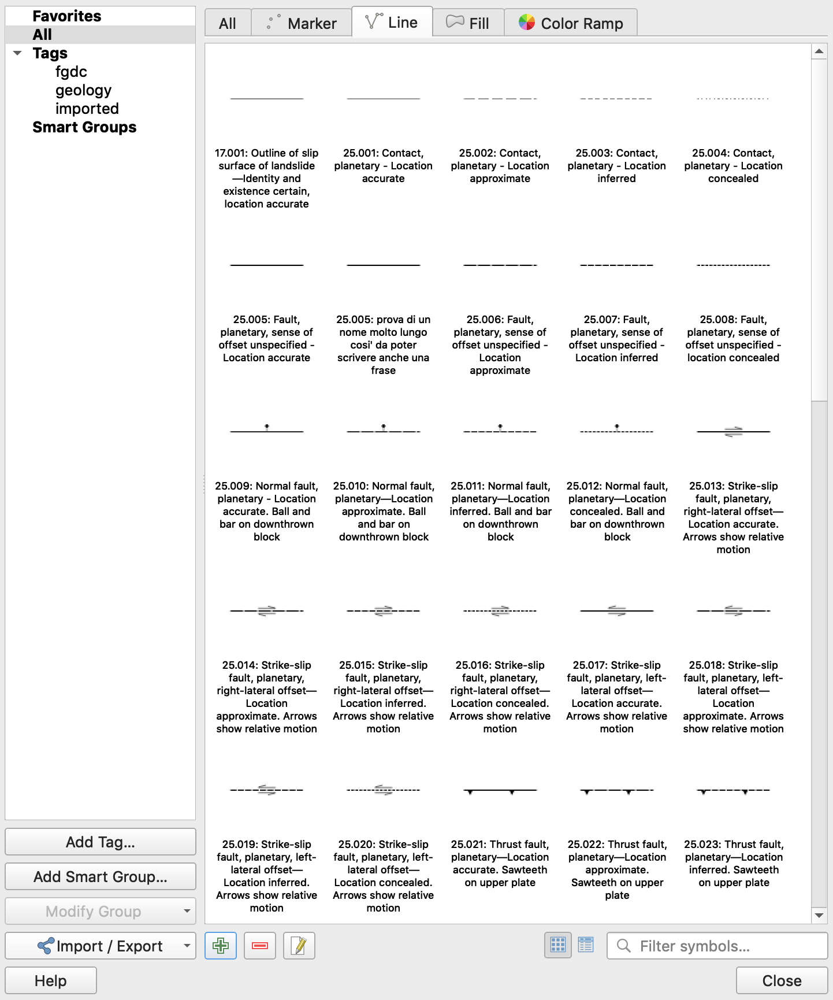

# Geologic symbols library and development for QGIS 
#### Alessandro Frigeri, IAPS/INAF - Aug, 2019

This project brings into QGIS symbols useful in geological mapping.  Styling for points, lines, fill patterns and gradients are included.  The symbols currently included in the library can be found in the [STATUS table](STATUS.md).  Currently the library includes symbols defined by FGDC, but others from different mapping authorities/institutionis can be added.

## System requirements

A functional QGIS 3.8.x (released on June 21st, 2019) or more recent software installation on MS Windows, OS X or GNU/Linux.

## Installation and setup

1. Download the [zipfile](https://github.com/afrigeri/geologic-symbols-qgis/raw/master/dist/geologic_symbols_qgis.zip) containing the symbology files.
2. Extract the zip archive and move the __svg__ directory to a place where you want to store the patterns and symbols.  It can be any directory.
3. Open QGis and go to 'Settings -> Options' (Ubuntu) or 'Preferences' (OSX) and select the second tab from the top: 'System'
4. Under the __SVG Paths__ form click the add button and select the the __svg__ directory you have just extracted from the zipfile.
5. Quit and open QGIS to make __SVG Paths__ modification active
5. In QGis, go to 'Settings -> Style Manager' and click on 'Import/Export -> Import items' button (at bottom-left)
6. Select the __geologic_symblib.xml__ file you have found in the zip file
7. You should now have the geologic symbols working in your QGis!

## How to contribute: add new symbols or fix existing ones

If you don't find a symbol in the [STATUS](STATUS.md) table, or you have found a mistake, you can contribute to the project.

There are several options to contribute to this project, as adding new symbols or refer a problem in an existing symbols.

1. Clone and work on your local copy 
or 
2. If you want to add symbols/graphics or update/fix existing ones, send the single symbol/svg __one symbol/graphics per file__ in the 'issue' section above on this page. When submitting the symbol select the 'New Symbol' green tag or the 'Symbol Fix' orange tag from the menu on the right, and attach the xml/svg file to the issue message (you will have to rename it .txt).

Remember to follow these simple guidelines:
1. Symbols should comply as much as possible with the original instructions.  If something can not be replicated, just indicate it in the issue tracker for future reference.
2. __Naming__: all the symbols should be named as follow: [code or id] : [Description]. This way it will be much more easier to use the symbols in QGIS.
3. For __asymmetric symbols__, convention here is to draw features clockwise, or leave the symbol to the left of the line.  For example, the downthrown block of a normal fault is stays on the left of the line. 

## Usage notes and conventions

Convention here is to draw area features clockwise, and linear features with patterns drawn on the left side, so non-symmetric symbology is displayed correctly.

## Similar projects

The problem of having a meaningful symbology in modern softwares has been in the air from a while.  Similarly to this project some other example have been available and are actively creating interesting solutions.

 * [QGis Geologic Symbols project from Ryan Mikulovsky at ucdavis, 2010](http://geo.distortions.net/2010/12/geologic-symbology-for-qgis.html)
 * [Stefan Revets project on SourceForge, 2015-2016](https://sourceforge.net/projects/qgisgeologysymbology/)
 * [FGCD Geologic Patterns for the Web by Daven Quinn, 2017](https://davenquinn.com/projects/geologic-patterns/). This project adopts the FGDC pattern of Daven Quinn, contributed by USGS personnell.

## References

* A. Nass, S. van Gasselt, R. Jaumann, H. Asche, Implementation of cartographic symbols for planetary mapping in geographic information systems, Planetary and Space Science, Volume 59, Issues 11-12, September 2011, Pages 1255-1264, ISSN 0032-0633, http://dx.doi.org/10.1016/j.pss.2010.08.022.
(http://www.sciencedirect.com/science/article/pii/S0032063310002606)

* Naß, A.; Fortezzo, C. M.; Skinner, J. A. Cartographic Symbolization in Geologic and Geomorphologic Maps — Specified Collection and GIS-Based Implementation for Planetary Science.  Third Planetary Data Workshop and The Planetary Geologic Mappers Annual Meeting, held June 12-15, 2017 in Flagstaff, Arizona. LPI Contribution No. 1986, id.7064

* Nass, Andrea; Fortezzo, Corey; Skinner, James, Jr.; Hunter, Marc; Hare, Trent Updated symbol catalogue for geologic and geomorphologic mapping in Planetary Scinces.  19th EGU General Assembly, EGU2017, proceedings from the conference held 23-28 April, 2017 in Vienna, Austria., p.16858
