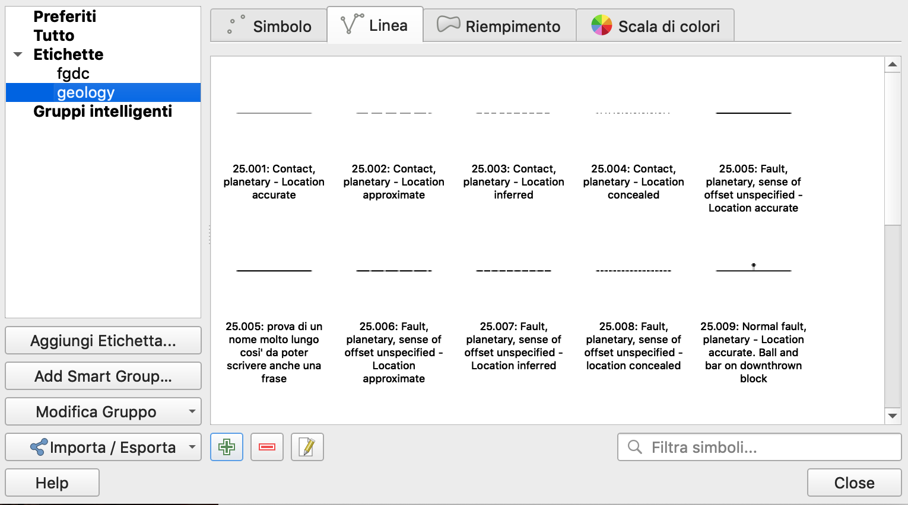

## Geologic symbols in QGIS 3.4 
#### June, 2019

Here you find the symbols for qgis which are useful in geological mapping.  At the moment there are the FGDC symbols, but others from different mapping authorities/institution can be added.

### Installation and setup

1. Download the [zipfile](https://github.com/afrigeri/geologic-symbols/raw/master/qgis/3.4/dist/geologic_symbols_qgis.zip) containing the symbology
2. Extract the zip archive and move the __svg__ directory to a place where you want to store the patterns and symbols.  It can be any directory.
3. Open QGis and go to 'Settings -> Options' (Ubuntu) or 'Preferences' (OSX) and select the second tab from the top: 'System'
4. Under the __SVG Paths__ form click the add button and select the directory where you moved the __svg__ directory
5. In QGis, go to 'Settings -> Style Manager' and click on 'Import/Export -> Import items' button (at bottom-left)
6. Select the __geologic_symblib.xml__ file you have found in the zip file
7. You should now have the geologic symbols working in your QGis!

### Current status

The [status page](STATUS.md) lists available symbols together with reference code and description.   

### Usage notes

convention here is to draw features clockwise, so non-symmetric symbology is displayed correctly.

