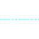
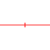
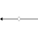

# Table of symbols, updated October 15, 2019
There are:
 * 118 entries for fgdc.
 * 1 entries for extra.

|                 graphics                 |authority|           code           |                                                           description                                                            |notes|
|------------------------------------------|---------|--------------------------|----------------------------------------------------------------------------------------------------------------------------------|-----|
|  |fgdc     |17.001                    |Outline of slip surface of landslide—Identity and existence certain, location accurate                                            |     |
|  |fgdc     |25.001                    |Contact, planetary - Location accurate                                                                                            |     |
|  |fgdc     |25.002                    |Contact, planetary - Location approximate                                                                                         |     |
|  |fgdc     |25.003                    |Contact, planetary - Location inferred                                                                                            |     |
|  |fgdc     |25.004                    |Contact, planetary - Location concealed                                                                                           |     |
|  |fgdc     |25.005                    |Fault, planetary, sense of offset unspecified - Location accurate                                                                 |     |
|  |fgdc     |25.006                    |Fault, planetary, sense of offset unspecified - Location approximate                                                              |     |
|  |fgdc     |25.007                    |Fault, planetary, sense of offset unspecified - Location inferred                                                                 |     |
|  |fgdc     |25.008                    |Fault, planetary, sense of offset unspecified - location concealed                                                                |     |
|  |fgdc     |25.009                    |Normal fault, planetary - Location accurate. Ball and bar on downthrown block                                                     |     |
|  |fgdc     |25.010                    |Normal fault, planetary—Location approximate. Ball and bar on downthrown block                                                    |     |
|  |fgdc     |25.011                    |Normal fault, planetary—Location inferred. Ball and bar on downthrown block                                                       |     |
|  |fgdc     |25.012                    |Normal fault, planetary—Location concealed. Ball and bar on downthrown block                                                      |     |
|  |fgdc     |25.013                    |Strike-slip fault, planetary, right-lateral offset—Location accurate. Arrows show relative motion                                 |     |
|  |fgdc     |25.014                    |Strike-slip fault, planetary, right-lateral offset—Location approximate. Arrows show relative motion                              |     |
|  |fgdc     |25.015                    |Strike-slip fault, planetary, right-lateral offset—Location inferred. Arrows show relative motion                                 |     |
|  |fgdc     |25.016                    |Strike-slip fault, planetary, right-lateral offset—Location concealed. Arrows show relative motion                                |     |
|  |fgdc     |25.017                    |Strike-slip fault, planetary, left-lateral offset—Location accurate. Arrows show relative motion                                  |     |
|  |fgdc     |25.018                    |Strike-slip fault, planetary, left-lateral offset—Location approximate. Arrows show relative motion                               |     |
|  |fgdc     |25.019                    |Strike-slip fault, planetary, left-lateral offset—Location inferred. Arrows show relative motion                                  |     |
|  |fgdc     |25.020                    |Strike-slip fault, planetary, left-lateral offset—Location concealed. Arrows show relative motion                                 |     |
|  |fgdc     |25.021                    |Thrust fault, planetary—Location accurate. Sawteeth on upper plate                                                                |     |
|  |fgdc     |25.022                    |Thrust fault, planetary—Location approximate. Sawteeth on upper plate                                                             |     |
|  |fgdc     |25.023                    |Thrust fault, planetary—Location inferred. Sawteeth on upper plate                                                                |     |
|  |fgdc     |25.024                    |Thrust fault, planetary-Location concealed. Sawteeth on upper plate                                                               |     |
|  |fgdc     |25.025                    |Graben trace, planetary (shown as single line where bounding normal faults cannot be mapped separately)—Location accurate         |     |
|  |fgdc     |25.026                    |Graben trace, planetary (shown as single line where bounding normal faults cannot be mapped separately)-Location approximate      |     |
|  |fgdc     |25.027                    |Graben trace, planetary (shown as single line where bounding normal faults cannot be mapped separately)-Location inferred         |     |
|  |fgdc     |25.028                    |Graben trace, planetary (shown as single line where bounding normal faults cannot be mapped separately)-Location concealed        |     |
|  |fgdc     |25.029                    |Regional fracture, planetary                                                                                                      |     |
|  |fgdc     |25.030                    |Partly buried regional fracture, planetary                                                                                        |     |
|  |fgdc     |25.031                    |Arcuate fracture, planetary                                                                                                       |     |
|  |fgdc     |25.032                    |Partly buried arcuate fracture, planetary                                                                                         |     |
|  |fgdc     |25.033                    |Radial fracture, planetary (associated with coronae)                                                                              |     |
|  |fgdc     |25.034                    |Concentric fracture, planetary (associated with coronae)                                                                          |     |
|  |fgdc     |25.035                    |Fold crest, planetary                                                                                                             |     |
|  |fgdc     |25.036                    |Broad warp, planetary                                                                                                             |     |
|  |fgdc     |25.037                    |Wrinkle ridge, planetary                                                                                                          |     |
|  |fgdc     |25.038                    |Ribbon trends, planetary                                                                                                          |     |
|  |fgdc     |25.039                    |Ridge belt, planetary                                                                                                             |     |
|  |fgdc     |25.040                    |Broad ridge crest, planetary (generally associated with coronae)                                                                  |     |
|  |fgdc     |25.041                    |Ridge crest, planetary (1st option)                                                                                               |     |
|  |fgdc     |25.042                    |Ridge crest (2nd option)                                                                                                          |     |
|  |fgdc     |25.043                    |Ridge crest, planetary (1st option)-Arrowhead shows abrupt termination of ridge                                                   |     |
|  |fgdc     |25.044                    |Ridge crest, planetary (2nd option)-Arrowhead shows abrupt termination of ridge                                                   |     |
|  |fgdc     |25.045                    |Ridge crest (possible dike), planetary                                                                                            |     |
|  |fgdc     |25.046                    |Corona annulus ridge, planetary-Showing axial trace and plunge. Short arrow indicates steeper limb or scarp boudnign corona trough|     |
|  |fgdc     |25.047                    |Groove (generic), planetary                                                                                                       |     |
|  |fgdc     |25.048                    |Sharp groove, planetary                                                                                                           |     |
|  |fgdc     |25.049                    |Subdued groove, planetary                                                                                                         |     |
|  |fgdc     |25.050                    |Radially grooved ejecta (schematic), planetary                                                                                    |     |
|  |fgdc     |25.051                    |Furrow, planetary                                                                                                                 |     |
|  |fgdc     |25.052                    |Trough or narrow depression, planetary                                                                                            |     |
|  |fgdc     |25.053                    |Depression (mapped to scale), planetary                                                                                           |     |
|  |fgdc     |25.054                    |Large depression (mapped to scale), planetary                                                                                     |     |
|  |fgdc     |25.055                    |Shallow, linear depression or valley, or narrow channel, planetary                                                                |     |
|  |fgdc     |25.056                    |Channel (canali), planetary                                                                                                       |     |
|  |fgdc     |25.057                    |Channel (canali)-Two short dashes where structureless or indefinite                                                               |     |
|  |fgdc     |25.058                    |Narrow channel (possible lava channel), planetary - Arrows point in direction of flow                                             |     |
|  |fgdc     |25.059                    |Erosional boundary, planetary-Hachures indicate truncated beds                                                                    |     |
|  |fgdc     |25.060                    |Angular unconformity, planetary-Hachures indicate truncated beds                                                                  |     |
|  |fgdc     |25.061                    |Angular unconformity, planetary-Uncertain. Hachures indicate truncated beds                                                       |     |
|  |fgdc     |25.062                    |Layer, planetary                                                                                                                  |     |
|  |fgdc     |25.063                    |Lineament, planetary                                                                                                              |     |
|  |fgdc     |25.064                    |Layering in canyon wall, planetary                                                                                                |     |
|  |fgdc     |25.065                    |Fabric of short radar-bright lineaments (schematic), planetary                                                                    |     |
|  |fgdc     |25.066                    |Penetrative lineations, within tessera terrain, planetary                                                                         |     |
|  |fgdc     |25.067                    |Flow direction, planetary                                                                                                         |     |
|  |fgdc     |25.068                    |Wind streaks, planetary-Arrow points in inferred wind direction                                                                   |     |
|  |fgdc     |25.069                    |Area of channelized erosion and scouring, planetary-Arrow points in direction of interpreted flow                                 |     |
|  |fgdc     |25.070                    |ARea of eolian transport, planetary-Arrow points in direction of air flow                                                         |     |
|  |fgdc     |25.071                    |Scarp, planetary-Hachures point downscarp                                                                                         |     |
|  |fgdc     |25.072                    |Lobate scarp, planetary-Hachures point downscarp                                                                                  |     |
|  |fgdc     |25.073                    |Basal scarp, planetary-Hachures point downscarp                                                                                   |     |
|  |fgdc     |25.074                    |Base of scarp, planetary—Barb points downscarp                                                                                    |     |
|  |fgdc     |25.075                    |Dome, edifice, or circular sharp, planetary (mapped to scale) -- Hachures point downscarp                                         |     |
|  |fgdc     |25.076                    |Very small shield, dome, or volcanic construct, planetary (not mapped to scale)                                                   |     |
|  |fgdc     |25.077                    |Small shield, dome, or volcanic construct, planetary (not mapped to scale)                                                        |     |
|  |fgdc     |25.078                    |Large, steep-sided shield, dome, or volcanic construct, planetary (not mapped to scale)                                           |     |
|  |fgdc     |25.079                    |Mesa, planetary (not mapped to scale)                                                                                             |     |
|  |fgdc     |25.080                    |Large shield, dome, or volcanic construct, planetary (mapped to scale)—Hachures point downscarp                                   |     |
|  |fgdc     |25.081                    |Large cone, planetary (mapped to scale)— Hachures point downscarp                                                                 |     |
|  |fgdc     |25.082                    |Knob or central peak, planetary (not mapped to scale)                                                                             |     |
|  |fgdc     |25.084                    |Elevated plateau, planetary (mapped to scale)— Hachures point downscarp                                                           |     |
|  |fgdc     |25.085                    |Steep-sided edifice, planetary (not mapped to scale)                                                                              |     |
|  |fgdc     |25.087                    |Large edifice, planetary (not mapped to scale)                                                                                    |     |
|  |fgdc     |25.088                    |Very small tholi, planetary (not mapped to scale)                                                                                 |     |
|  |fgdc     |25.089                    |Small tholi, planetary (not mapped to scale)                                                                                      |     |
|  |fgdc     |25.091                    |Corona, planetary                                                                                                                 |     |
|  |fgdc     |25.092                    |Nova, planetary                                                                                                                   |     |
|  |fgdc     |25.093                    |Palimpsest ring, planetary                                                                                                        |     |
|  |fgdc     |25.094                    |Raised rim of larger impact crater, planetary— Hachures point into crater                                                         |     |
|  |fgdc     |25.095                    |Raised rim of smaller impact crater, planetary                                                                                    |     |
|  |fgdc     |25.097                    |Degraded impact crater rim, planetary (1st option)                                                                                |     |
|  |fgdc     |25.098                    |Rimless impact crater, subdued impact crater rim, degraded impact crater rim (2nd option), or buried impact crater rim, planetary |     |
|  |fgdc     |25.099                    |Secondary impact crater chain and cluster, planetary                                                                              |     |
|  |fgdc     |25.100                    |Basin ring, planetary                                                                                                             |     |
|  |fgdc     |25.101                    |Central peak of impact crater, planetary (1st option)                                                                             |     |
|  |fgdc     |25.102                    |Central peak of impact crater, planetary (2nd option)                                                                             |     |
|  |fgdc     |25.104                    |Pit of impact crater floor, planetary (2nd option)                                                                                |     |
|  |fgdc     |25.105                    |Pit-crater chain (mapped to scale), planetary                                                                                     |     |
|  |fgdc     |25.106                    |Small endogenic crater, planetary                                                                                                 |     |
|  |fgdc     |25.107                    |Small endogenic crater (mapped to scale), planetary                                                                               |     |
|  |fgdc     |25.109                    |Large endogenic crater (mapped to scale), planetary                                                                               |     |
|  |fgdc     |25.111                    |Caldera, planetary                                                                                                                |     |
|  |fgdc     |25.114                    |Flow front, planetary—Arrow indicates flow direction                                                                              |     |
|  |fgdc     |25.115                    |Mountain (rugged), planetary—Origin uncertain                                                                                     |     |
|  |fgdc     |25.116                    |Channel bars, planetary—May be erosional or depositional                                                                          |     |
|  |fgdc     |25.117                    |Slide or slump material, planetary—Arrow indicates direction of movement                                                          |     |
|  |fgdc     |25.118                    |Dark-colored ejecta, planetary                                                                                                    |     |
|  |fgdc     |25.119                    |Light-colored ejecta, planetary                                                                                                   |     |
|  |fgdc     |25.120                    |Terrace deopsits, planetary                                                                                                       |     |
|  |fgdc     |25.121                    |Dark-colored mantling material, planetary                                                                                         |     |
|  |fgdc     |25.122                    |Secondary crater field, planetary                                                                                                 |     |
|  |fgdc     |25.126                    |Detached lobe, planetary—Arrow points in direction of interpreted landslide or debris flow                                        |     |
||fgdc     |30.1.001                  |Index topographic contour (1st option)                                                                                            |     |
||fgdc     |30.1.003                  |Intermediate topographic contour (1st option)                                                                                     |     |
|  |fgdc     |31.021                    |Sample locality—Showing sample number                                                                                             |     |
|extra                                     |Parula   |a topographic map gradient|                                                                                                                                  |None |
