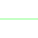

# Table of symbols, updated July 26, 2019
There are:
 * 85 entries for fgdc.
 * 1 entries for extra.

|                 graphics                 |authority|           code            |                                                            description                                                            |notes|
|------------------------------------------|---------|---------------------------|-----------------------------------------------------------------------------------------------------------------------------------|-----|
|  |fgdc     |                      17.00| Outline of slip surface of landslide—Identity and existence certain, location accurate                                            |     |
|  |fgdc     |                      25.00| Contact, planetary - Location accurate                                                                                            |     |
|  |fgdc     |                      25.00| Contact, planetary - Location approximate                                                                                         |     |
|  |fgdc     |                      25.00| Contact, planetary - Location inferred                                                                                            |     |
|  |fgdc     |                      25.00| Contact, planetary - Location concealed                                                                                           |     |
|  |fgdc     |                      25.00| Fault, planetary, sense of offset unspecified - Location accurate                                                                 |     |
|  |fgdc     |                      25.01| Fault, planetary, sense of offset unspecified - Location approximate                                                              |     |
|  |fgdc     |                      25.01| Fault, planetary, sense of offset unspecified - Location inferred                                                                 |     |
|  |fgdc     |                      25.01| Fault, planetary, sense of offset unspecified - location concealed                                                                |     |
|  |fgdc     |                      25.01| Normal fault, planetary - Location accurate. Ball and bar on downthrown block                                                     |     |
|  |fgdc     |                      25.01| Normal fault, planetary—Location approximate. Ball and bar on downthrown block                                                    |     |
|  |fgdc     |                      25.01| Normal fault, planetary—Location inferred. Ball and bar on downthrown block                                                       |     |
|  |fgdc     |                      25.01| Normal fault, planetary—Location concealed. Ball and bar on downthrown block                                                      |     |
|  |fgdc     |                      25.01| Strike-slip fault, planetary, right-lateral offset—Location accurate. Arrows show relative motion                                 |     |
|  |fgdc     |                      25.01| Strike-slip fault, planetary, right-lateral offset—Location approximate. Arrows show relative motion                              |     |
|  |fgdc     |                      25.01| Strike-slip fault, planetary, right-lateral offset—Location inferred. Arrows show relative motion                                 |     |
|  |fgdc     |                      25.02| Strike-slip fault, planetary, right-lateral offset—Location concealed. Arrows show relative motion                                |     |
|  |fgdc     |                      25.02| Strike-slip fault, planetary, left-lateral offset—Location accurate. Arrows show relative motion                                  |     |
|  |fgdc     |                      25.02| Strike-slip fault, planetary, left-lateral offset—Location approximate. Arrows show relative motion                               |     |
|  |fgdc     |                      25.02| Strike-slip fault, planetary, left-lateral offset—Location inferred. Arrows show relative motion                                  |     |
|  |fgdc     |                      25.02| Strike-slip fault, planetary, left-lateral offset—Location concealed. Arrows show relative motion                                 |     |
|  |fgdc     |                      25.02| Thrust fault, planetary—Location accurate. Sawteeth on upper plate                                                                |     |
|  |fgdc     |                      25.02| Thrust fault, planetary—Location approximate. Sawteeth on upper plate                                                             |     |
|  |fgdc     |                      25.02| Thrust fault, planetary—Location inferred. Sawteeth on upper plate                                                                |     |
|  |fgdc     |                      25.03| Concentric fracture, planetary (associated with coronae)                                                                          |     |
|  |fgdc     |                      25.02| Graben trace, planetary (shown as single line where bounding normal faults cannot be mapped separately)—Location accurate         |     |
|  |fgdc     |                      25.03| Graben trace, planetary (shown as single line where bounding normal faults cannot be mapped separately)-Location approximate      |     |
|  |fgdc     |                      25.03| Graben trace, planetary (shown as single line where bounding normal faults cannot be mapped separately)-Location inferred         |     |
|  |fgdc     |                      25.03| Graben trace, planetary (shown as single line where bounding normal faults cannot be mapped separately)-Location concealed        |     |
|  |fgdc     |                      25.03| Regional fracture, planetary                                                                                                      |     |
|  |fgdc     |                      25.03| Partly buried regional fracture, planetary                                                                                        |     |
|  |fgdc     |                      25.03| Arcuate fracture, planetary                                                                                                       |     |
|  |fgdc     |                      25.03| Partly buried arcuate fracture, planetary                                                                                         |     |
|  |fgdc     |                      25.03| Radial fracture, planetary (associated with coronae)                                                                              |     |
|  |fgdc     |                      25.03| Concentric fracture, planetary (associated with coronae)                                                                          |     |
|  |fgdc     |                      25.03| Fold crest, planetary                                                                                                             |     |
|  |fgdc     |                      25.04| Broad warp, planetary                                                                                                             |     |
|  |fgdc     |                      25.04| Wrinkle ridge, planetary                                                                                                          |     |
|  |fgdc     |                      25.04| Ribbon trends, planetary                                                                                                          |     |
|  |fgdc     |                      25.04| Ridge belt, planetary                                                                                                             |     |
|  |fgdc     |                      25.04| Broad ridge crest, planetary (generally associated with coronae)                                                                  |     |
|  |fgdc     |                      25.04| Ridge crest, planetary (1st option)                                                                                               |     |
|  |fgdc     |                      25.04| Ridge crest (2nd option)                                                                                                          |     |
|  |fgdc     |                      25.04| Ridge crest, planetary (1st option)-Arrowhead shows abrupt termination of ridge                                                   |     |
|  |fgdc     |                      25.04| Ridge crest, planetary (2nd option)-Arrowhead shows abrupt termination of ridge                                                   |     |
|  |fgdc     |                      25.04| Ridge crest (possible dike), planetary                                                                                            |     |
|  |fgdc     |                      25.05| Corona annulus ridge, planetary-Showing axial trace and plunge. Short arrow indicates steeper limb or scarp boudnign corona trough|     |
|  |fgdc     |                      25.05| Groove (generic), planetary                                                                                                       |     |
|  |fgdc     |                      25.05| Sharp groove, planetary                                                                                                           |     |
|  |fgdc     |                      25.05| Subdued groove, planetary                                                                                                         |     |
|  |fgdc     |                      25.05| Radially grooved ejecta (schematic), planetary                                                                                    |     |
|  |fgdc     |                      25.05| Furrow, planetary                                                                                                                 |     |
|  |fgdc     |                      25.05| Trough or narrow depression, planetary                                                                                            |     |
|  |fgdc     |                      25.05| Shallow, linear depression or valley, or narrow channel, planetary                                                                |     |
|  |fgdc     |                      25.06| Channel (canali), planetary                                                                                                       |     |
|  |fgdc     |                      25.06| Channel (canali)-Two short dashes where structureless or indefinite                                                               |     |
|  |fgdc     |                      25.06| Narrow channel (possible lava channel), planetary - Arrows point in direction of flow                                             |     |
|  |fgdc     |                      25.06| Erosional boundary, planetary-Hachures indicate truncated beds                                                                    |     |
|  |fgdc     |                      25.06| Angular unconformity, planetary-Hachures indicate truncated beds                                                                  |     |
|  |fgdc     |                      25.06| Angular unconformity, planetary-Uncertain. Hachures indicate truncated beds                                                       |     |
|  |fgdc     |                      25.06| Layer, planetary                                                                                                                  |     |
|  |fgdc     |                      25.06| Lineament, planetary                                                                                                              |     |
|  |fgdc     |                      25.06| Layering in canyon wall, planetary                                                                                                |     |
|  |fgdc     |                      25.06| Fabric of short radar-bright lineaments (schematic), planetary                                                                    |     |
|  |fgdc     |                      25.07| Penetrative lineations, within tessera terrain, planetary                                                                         |     |
|  |fgdc     |                      25.07| Flow direction, planetary                                                                                                         |     |
|  |fgdc     |                      25.07| Wind streaks, planetary-Arrow points in inferred wind direction                                                                   |     |
|  |fgdc     |                      25.07| Area of channelized erosion and scouring, planetary-Arrow points in direction of interpreted flow                                 |     |
|  |fgdc     |                      25.07| ARea of eolian transport, planetary-Arrow points in direction of air flow                                                         |     |
|  |fgdc     |                      25.07| Scarp, planetary-Hachures point downscarp                                                                                         |     |
|  |fgdc     |                      25.07| Lobate scarp, planetary-Hachures point downscarp                                                                                  |     |
|  |fgdc     |                      25.07| Basal scarp, planetary-Hachures point downscarp                                                                                   |     |
|  |fgdc     |                      25.07| Base of scarp, planetary—Barb points downscarp                                                                                    |     |
|  |fgdc     |                      25.08| Elevated plateau, planetary (mapped to scale)— Hachures point downscarp                                                           |     |
|  |fgdc     |                      25.10| Central peak of impact crater, planetary (1st option)                                                                             |     |
|  |fgdc     |                      25.10| Central peak of impact crater, planetary (2nd option)                                                                             |     |
|  |fgdc     |                      25.12| Joint or fracture pattern, planetary                                                                                              |     |
|  |fgdc     |                      25.12| Slide or slump material, planetary—Arrow indicates direction of movement                                                          |     |
|  |fgdc     |                      25.12| Dark-colored ejecta, planetary                                                                                                    |     |
|  |fgdc     |                      25.12| Light-colored ejecta, planetary                                                                                                   |     |
|  |fgdc     |                      25.12| Secondary crater field, planetary                                                                                                 |     |
|  |fgdc     |                      25.13|  Detached lobe, planetary—Arrow points in direction of interpreted landslide or debris flow                                       |     |
||fgdc     |30.1.001                   | Index topographic contour (1st option)                                                                                            |     |
||fgdc     |30.1.003                   | Intermediate topographic contour (1st option)                                                                                     |     |
|  |fgdc     |                      31.02| Sample locality—Showing sample number                                                                                             |     |
|extra                                     |Parula   | a topographic map gradient|                                                                                                                                   |     |
